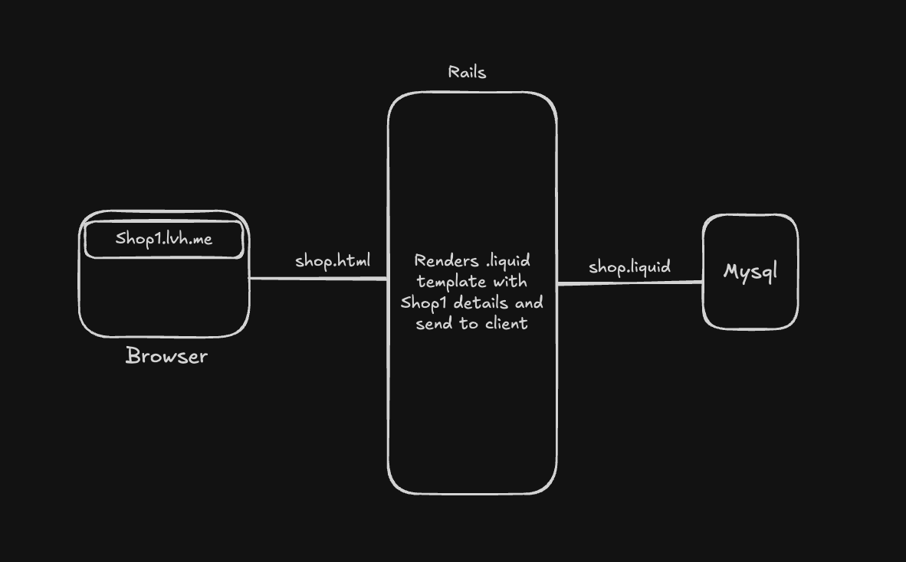

# README

<IN PROGRESS>
AIM or this repo
- Store view files to any source like DB or S3, fetch and render from there, views are not meant to be only in app/ directory
- Multitenancy with subdomain
- Allow user to create their own theme, using shopify liquid language

## Internal Working
- From domain/sub-domain get the Shop Details
- Fetches template from DB, based on current shops theme
- Then renders it with locals, passed from controller

https://github.com/user-attachments/assets/a443f047-eddc-4af6-abd6-3134ad1ff6b0

